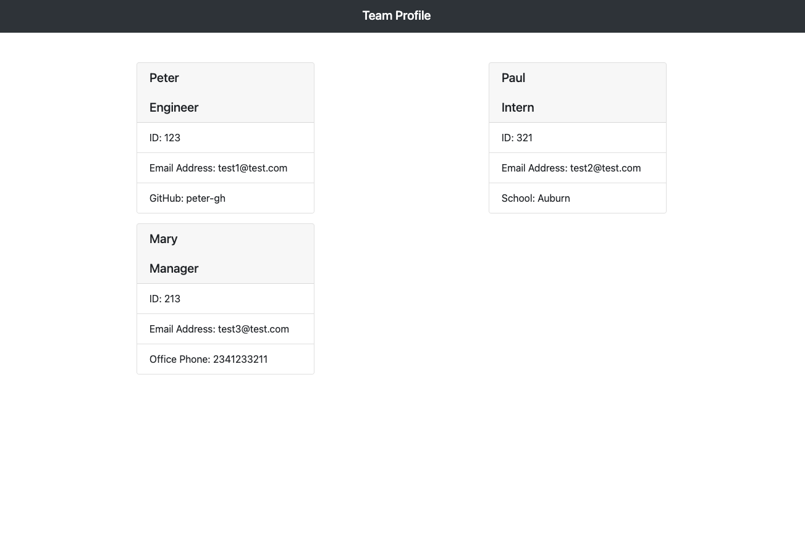

# Team-Profile-Generator

## Description
We were challenged to build a coomand-line application that takes in data about employees and generates a webpage that displays cards for each individual. Another part of the challenge is to write unit tests for each portion of the code, ensuring that each passes. 

## User Story
AS A manager  
I WANT to generate a webpage that display my team's basic info  
SO THAT I have quick access to their emails and GitHub profiles

## Acceptance Criteria
GIVEN a command-line application that accepts user input  
WHEN I am prompted for my team members and their information  
THEN an HTML file is generated that displays a nicely formatted team roster based on user input  
WHEN I click on an email address in the HTML  
THEN my default email program opens and populates the TO field of the email with the address  
WHEN I click on the GitHub username  
THEN that GitHub profile opens in a new tab  
WHEN I start the application  
THEN I am prompted to enter the team manager’s name, employee ID, email address, and office number  
WHEN I enter the team manager’s name, employee ID, email address, and office number  
THEN I am presented with a menu with the option to add an engineer or an intern or to finish building my team  
WHEN I select the engineer option  
THEN I am prompted to enter the engineer’s name, ID, email, and GitHub username, and I am taken back to the menu  
WHEN I select the intern option  
THEN I am prompted to enter the intern’s name, ID, email, and school, and I am taken back to the menu  
WHEN I decide to finish building my team  
THEN I exit the application, and the HTML is generated  

## Video Walkthrough/Rendered HTML and GitHub Link
[Screen Recording](https://drive.google.com/file/d/1AZcpuRHUcgTW02y4OY4QpqlJjOdn0IyM/view?usp=sharing)  
https://github.com/timothy-wardlow/Team-Profile-Generator   

## Installation
- Git clone this repository to your local machine
- Run 'npm install' in the working directory
- Run 'node index.js' to begin the application
- Inquirer prompts will collect data
- Team profile webpage will be generated and can be found in the 'dist' folder under the 'index.html' file

## Credits
StackOverflow, Instructors

## License
MIT

## Contact
https://github.com/timothy-wardlow
